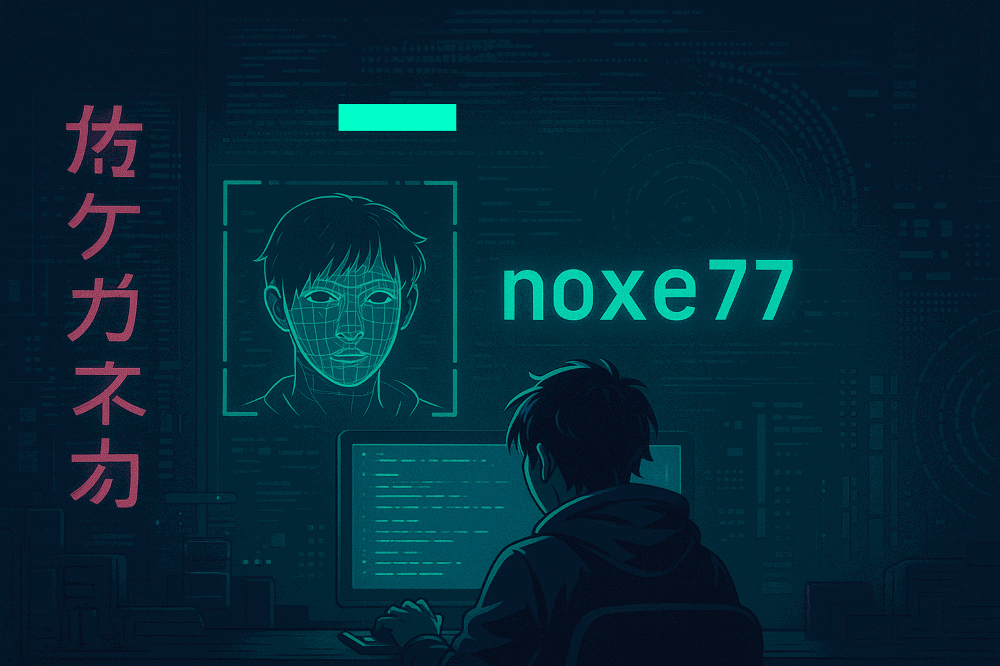
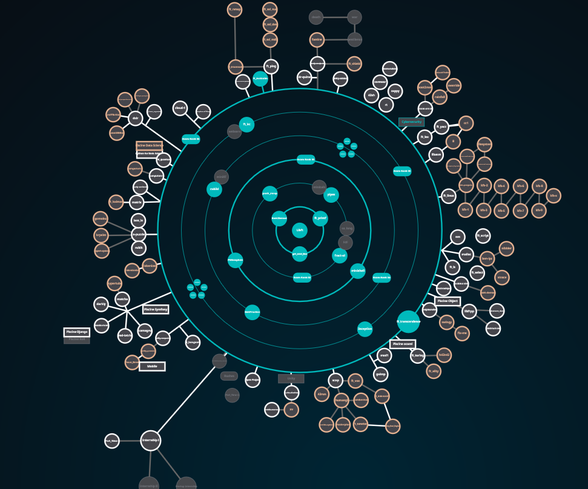

<!-- Banner -->

  

---

<h1 align="center">🧠 Mohamed Ouahab aka noxe77</h1>

  <b>42 Student | Cybersecurity Enthusiast | C & Python Addict</b>  

---

### 👾 Qui suis-je ?

Salut ! Je suis Mohamed, passionné de **cybersécurité offensive** 🕵️, de **systèmes Unix/Linux** 🐧 et de **programmation bas niveau** 💻.  
🎓 Formé à l’école 42, je développe des outils où la sécurité, l'efficacité et la maîtrise technique sont prioritaires.

🎯 Actuellement à la recherche d’un **stage en cybersécurité** (Pentest, Red Team, CTF, Reverse Engineering...).

---

### 🧰 Stack technique

---

### 🔐 Projets en cybersécurité

| 🛠️ Projet | 📘 Description |
|----------|----------------|
| [**ft_otp**](https://github.com/moouahab/ft_otp) | Générateur TOTP/HOTP en Python avec chiffrement Fernet |
| [**minishell**](https://github.com/moouahab/minishell) | Shell Unix minimaliste en C (fork, exec, signaux, parsing) |
| [**IRC_server_42**](https://github.com/moouahab/IRC_server_42) | Serveur IRC codé en C++ (gestion des sockets, utilisateurs, messages) |
| [**get_next_line**](https://github.com/moouahab/get_next_line) | Lecture ligne par ligne depuis un `fd`, gestion mémoire sécurisée |
| [**push_swap**](https://github.com/moouahab/push_swap) | Tri d'entiers avec algorithmes optimisés pour le nombre de coups |

---

### 🧠 Vision technique

  

---

### ✨ Ambiance & terminal vibes

  
  

---

### 🚀 Objectif 2025

- ✅ Finaliser les projets système de 42  
- ✅ Développer des outils de sécurité (TOTP, bruteforce, etc.)  
- ⏳ Contribuer à un projet open source en cybersécurité  
- 🎯 Intégrer une équipe Red Team / Pentest  

---

### 📫 Me contacter

- 📧 Email : mohamed.ouahab1999@email.com  
- 🔗 LinkedIn : [https://www.linkedin.com/in/mohamed-ouahab-91b215336/](#)  
- 💻 GitHub : [github.com/moouahab](https://github.com/moouahab)  

---

> _"Hacking is not just about code. It’s about curiosity, discipline, and mastering the system."_  
> — **noxe77**
